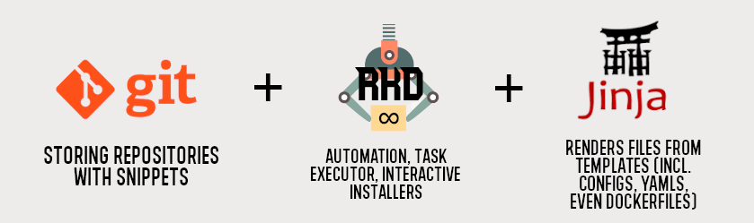

Snippet Cooperative (RKD-COOP)
==============================

Sharing snippets, plugins, packages never was so easy. :code:`rkd-coop` is a GIT-based tool similar to package manager that have repositories on GIT/Github!
Uses popular and easy JINJA2 templating to render configuration files based on answers asked to the user during snippet installation.

**Perfect tool to:**

- Share ready-to-use, customizable configuration files
- Share docker-compose.yml definitions where you can parametrize database credentials, container names
- Install plugins to any application (example flow: ask which version, download, unpack)

.. code:: bash

    pip install rkd-snippet-cooperative

    export COOP_REPOSITORIES=https://github.com/riotkit-org/riotkit-harbor-snippet-cooperative
    rkd-coop :cooperative:sync          # similar to apt update, huh?
    rkd-coop :cooperative:install harbor/redis

Installing
----------

.. code:: bash

    # with pipenv
    pipenv install rkd-cooperative

    # using regular PIP
    pip install rkd-cooperative

How it works?
-------------

The mechanism is using GIT repository as a central repository of content, there is a command to synchronize all repositories :code:`rkd-coop :cooperative:sync`.
With :code:`rkd-coop :cooperative:install NAME` a snippet can be installed from local repository.

Repository and snippets structure
---------------------------------

**Example structure**

.. code:: yaml

    README.md

    # main directory with snippets, can contain directories with snippets directly or additionally the categories
    snippets/
    snippets/web-servers/

    # snippet main directory, maintained by a maintainers listed in a separate file
    snippets/web-servers/nginx
    snippets/web-servers/nginx/snippet.json  # this file is mandatory for RKD-COOP to find the snippet at all

    # RKD's makefile defines how to install the snippet (eg. interactive installation wizards)
    snippets/web-servers/nginx/.rkd/makefile.yaml

    # files to copy to "./" (current workspace), all *.j2 files are rendered and .j2 extensions are cut off
    # can include subdirectories of any depth
    snippets/web-servers/nginx/files/nginx.conf.j2

**Example snippet.json file**

.. code:: json

    {
        "description": "Simplest Redis Server configuration with persistent volume",
        "maintainers": ["Andrew Johnson <https://github.com/blackandred>"],
        "version": "1.0"
    }

Makefile - creating interactive wizards
---------------------------------------

In RKD's Makefile you can define tasks. The RKD-COOP is expecting that you could define task :code:`:snippet:wizard`,
in which you can use a **Wizard** to ask user questions. Of course RKD's tasks are executed in a programming language, so you can
actually do everything you want there using Bash and Python.

Below is an example :code:`.rkd/makefile.yaml` file with customized "wizard" that asks user for a domain name, and for the basic auth password.
Please notice the **to_env=True** - it means, that user input would be written to **.env** file as *AUTH_PASSWORD* variable.

Every **attribute** is exposed into \*.j2 templates when those are rendered, giving a possibility to render customized files basing on user input.

.. code:: yaml

    version: org.riotkit.rkd/yaml/v1
    tasks:
        :snippet:wizard:
            arguments:
                "path":
                    help: "Path to the snippet"
            steps: |
                #!python
                from rkd.inputoutput import Wizard

                Wizard(this)\
                    .ask('Domain name', attribute='domain_name', regexp='([A-Za-z0-9_]+)', default='localhost')\
                    .ask('Basic auth password', attribute='AUTH_PASSWORD', to_env=True)\
                    .finish()

Makefile - advanced usage: Overriding files copying procedure
-------------------------------------------------------------

Beside the *:snippet:wizard* task RKD-COOP allows to customize the process of installing the snippet. The default behavior
is to copy all files from **"files"** directory recursively, and render \*.j2 templates on-the-fly. That's a pretty universal behavior.

:code:`:snippet:install` can be implemented to override default behavior with eg. file downloading and unpacking, git cloning or other desired behavior.

.. code:: yaml

    version: org.riotkit.rkd/yaml/v1
    tasks:
        #
        # Here could be defined also other tasks, including :snippet:wizard
        # You can call other tasks in Bash with: %RKD% :my-task-name
        # In Python: this.rkd([':my-task-name', '--some-argument=some-value'])
        #

        :snippet:install:
            arguments:
                "path":
                    help: "Path to the snippet"
            steps: |
                #!bash
                wget https://github.com/riotkit-org/tunman/archive/master.zip
                unzip master.zip
                rm master.zip
                # ...

Join it into your project or custom RKD distribution
----------------------------------------------------

RKD-COOP is a set of RKD tasks you can import into any project. Additionally you can define :code:`COOP_REPOSITORIES` environment variable by default
so your project would use fixed repositories by default when calling sync task.

Simply set :code:`COOP_REPOSITORIES` in makefile.yaml, makefile.py or in .env file.

**For makefile.py (RKD Makefile.py syntax)**

.. code:: python

    from rkd_cooperative import imports as CoopImports

    IMPORTS += CoopImports()

**For makefile.yaml (RKD Makefile YAML syntax)**

.. code:: yaml

    imports:
        - rkd_cooperative

Simplicity over complexity
--------------------------

Snippet cooperative is not an application store, or a package manager.
It is intended to be a simple snippet store, but we do not exclude implementation of "store-like" mechanism in the future if there will be a lot of requests for such feature.

From authors
------------

We are grassroot activists for social change, so we created this software while we were helping those fantastic initiatives:

- RiotKit (https://riotkit.org)
- International Workers Association (https://iwa-ait.org)
- Anarchistyczne FAQ (http://anarchizm.info) a translation of Anarchist FAQ (https://theanarchistlibrary.org/library/the-anarchist-faq-editorial-collective-an-anarchist-faq)
- Federacja Anarchistyczna (http://federacja-anarchistyczna.pl)
- Związek Syndykalistów Polski (https://zsp.net.pl) (Polish section of IWA-AIT)
- Komitet Obrony Praw Lokatorów (https://lokatorzy.info.pl)
- Solidarity Federation (https://solfed.org.uk)
- Priama Akcia (https://priamaakcia.sk)

Special thanks to `Working Class History <https://twitter.com/wrkclasshistory>`_ for very powerful samples that we could use in our unit tests.
